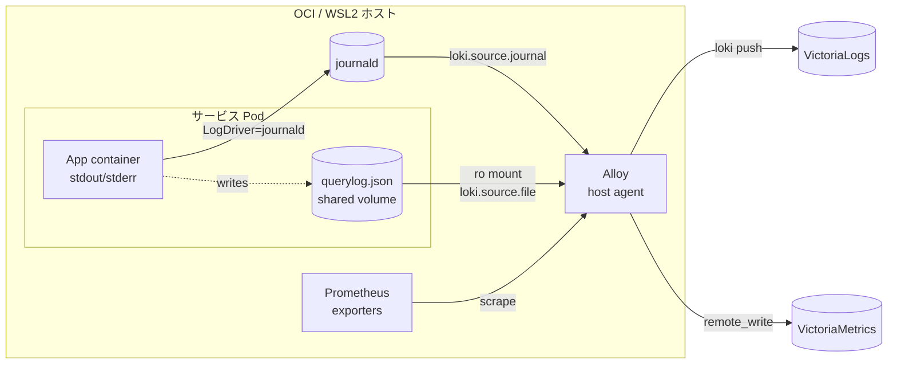

# ADR-008: コレクタを Alloy に一元化し fluent-bit サイドカーを廃止

- **Status**: accepted
- **Date**: 2026-04-15

## Context

[ADR-007](007-log-backend-victorialogs.md) でログ集約バックエンドに VictoriaLogs を採用した。これに伴い、ホスト側のログ・メトリクス収集エージェントを選定する必要がある。

現状は [ADR-006](006-adguard-querylog-fluent-bit-sidecar.md) により、AdGuard Home のクエリログ（コンテナ内ファイル）を fluent-bit サイドカーで stdout 経由 journald に転送している。Phase 2 移行に際して、この fluent-bit サイドカーを残すか撤去するかを判断する必要がある。

選択肢は 2 案:

- **案 A**: fluent-bit サイドカーを据え置き、ホストに Alloy を追加。サービスのファイルログは `file → fluent-bit → stdout → journald → Alloy` の 2 ホップ経路
- **案 B**: Alloy をホストエージェントとして配置し、ファイルログは Alloy が直接 tail。fluent-bit サイドカーは撤去

## Decision

**案 B を採用する。Alloy をホストエージェントとして各マシン（OCI / WSL2）に 1 プロセス配置し、container stdout は journald 経由、アプリ固有ファイルログは Alloy が直接 tail する。fluent-bit サイドカーは廃止し、ADR-006 は superseded とする。**

### 構成図

### 経路整理

- **container stdout/stderr**: `LogDriver=journald` は維持。journald に入ったログを Alloy の `loki.source.journal` で拾う
- **アプリ固有ファイルログ** (例: AdGuard `querylog.json`): shared volume を Alloy コンテナにも `ro` でマウントし、`loki.source.file` で直接 tail
- **metrics**: Alloy の `prometheus.scrape` でエンドポイントを叩き、`prometheus.remote_write` で VictoriaMetrics に push
- **ラベル整形**: journald の `_SYSTEMD_UNIT` を `service` ラベルに、コンテナ由来なら `CONTAINER_NAME` を拾うなどの relabel を Alloy で実施
- **マルチホスト**: WSL2 ホストも同構成。Alloy が Tailnet 越しに OCI の VictoriaLogs / VictoriaMetrics に push。認証は Tailscale ACL で閉じる

### 却下理由（案 A）

- fluent-bit + Alloy の 2 エージェント併存は設定言語・運用観の二重化を招く
- ログ経路が 2 ホップになり、デバッグ時の視界が悪化する
- journald のローテーション設定がログ保持の上流制約として残り続ける
- コンテナ数・Quadlet ユニット数が減らない

## Consequences

### 良い面

- コレクタが Alloy 1 プロセス / ホストに集約され、設定・運用認知負荷が最小化される
- ログ経路が 1 ホップになり、経路起因の障害ポイントが減る
- ファイルログの保持・ラベル付与を Alloy 側で一貫制御できる（journald ローテ制約から解放）
- サービス追加時のパターン（Quadlet 定義 + shared volume + Alloy 側 file source 追加）が単純化される

### 悪い面

- [ADR-006](006-adguard-querylog-fluent-bit-sidecar.md) は superseded となり、fluent-bit サイドカー Quadlet・設定ファイルは撤去が必要
- 既存サービスの Quadlet に Alloy 用の read-only volume マウント追加が発生する
- AdGuard Home 停止中に `querylog.json` がローテートされた場合のハンドリングは Alloy の `loki.source.file` 挙動に依存する（fluent-bit 時代から挙動差分が出る可能性あり）
- Alloy プロセスがホスト単一障害点になる。落ちた期間のログは欠損する（journald 側には残るが VictoriaLogs には届かない）

### 移行手順（概略）

1. Alloy の Quadlet / NixOS モジュールを整備し、journald source + 既存サービスのメトリクス scrape を動作確認
2. ダッシュボード・アラートを整備
3. AdGuard Home の `querylog.json` を Alloy 直読みに切り替え、fluent-bit サイドカー Quadlet を撤去
4. [log-strategy.md](../patterns/log-strategy.md) を本構成に書き換え、[ADR-006](006-adguard-querylog-fluent-bit-sidecar.md) を superseded として残す
