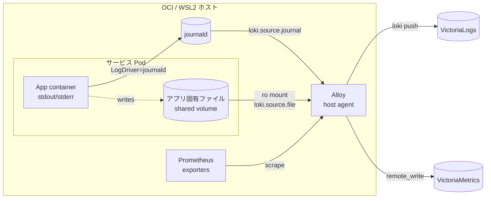

# ログ戦略

すべてのサービスログを journald に集約する。コンテナの標準出力は `LogDriver=journald` で自動的に journald に入るが、アプリケーション固有のログファイルは別途対応が必要。

## 以前（Phase 1 — journald 集約のみ）

```
コンテナ stdout/stderr ──► LogDriver=journald ──► journalctl -u <unit>

アプリ固有ログファイル ──► fluent-bit sidecar ──► stdout ──► journald
                          (shared volume, ro)
```

- 標準: `LogDriver=journald` を全コンテナに設定（[Quadlet 構成規約](quadlet-conventions.md)を参照）
- 例外: アプリがファイルにしかログを書かない場合（AdGuard Home の querylog 等）は fluent-bit サイドカーで tail → stdout → journald に転送する（[ADR-006](../adr/006-adguard-querylog-fluent-bit-sidecar.md)）

> **注**: fluent-bit サイドカーは M4 で撤去予定。M1 で Alloy が導入されたため、journald 以外のログ (AdGuard querylog 等) も Alloy の `loki.source.file` で直接収集する方針に移行する。

## 現在（Phase 2 — Alloy + VictoriaLogs / VictoriaMetrics）

journald 依存から、ホストエージェント型の Alloy + VictoriaLogs / VictoriaMetrics スタックへ移行する。バックエンド選定は [ADR-007](../adr/007-log-backend-victorialogs.md)、コレクタ構成は [ADR-008](../adr/008-alloy-unified-collector.md) を参照。



- コレクタ: **Alloy** をホストに 1 プロセス配置（Quadlet / systemd ユニット）
- container stdout: `LogDriver=journald` は維持、Alloy の `loki.source.journal` で拾う
- アプリ固有ファイルログ: shared volume を Alloy にも `ro` でマウントし、`loki.source.file` で直接 tail（fluent-bit サイドカーは廃止）
- metrics: Alloy の `prometheus.scrape` → `prometheus.remote_write` で VictoriaMetrics に push
- マルチホスト: WSL2 ホストの Alloy は Tailnet 越しに OCI 側 VL/VM へ push
